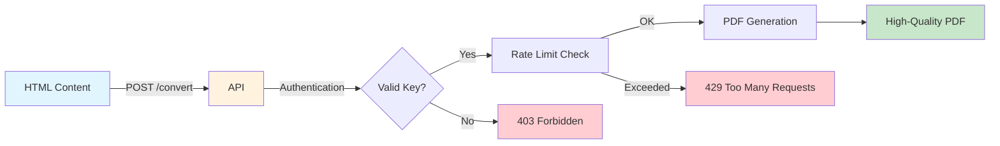

# 📄 HTML-to-PDF Converter API

<div align="center">


**Transform HTML to Professional PDFs in Seconds** 🚀

*A lightning-fast, production-ready, self-hosted REST API for converting HTML content to high-quality PDF documents. Deploy your own instance in minutes!*

**Perfect for invoices, reports, certificates, and any document automation needs.**

[Quick Start](#-quick-start) • [Deploy Your Own](#-deployment-guide) • [API Docs](#-api-documentation) • [Examples](#-usage-examples) • [Security](#-security--authentication)

[](DEPLOYMENT.md)
[](#docker-deployment)
[](https://github.com/systemifyautomation/HTML-to-PDF/fork)

</div>

---

## 🌟 Why Self-Host Your Own PDF API?

<div align="center">

**Take full control of your document generation infrastructure**

</div>

- 💰 **Zero Per-Request Costs** - No usage fees, process unlimited PDFs
- 🔒 **Complete Data Privacy** - Your documents never leave your server
- ⚡ **Maximum Performance** - No third-party API latency
- 🎨 **Full Customization** - Modify the code to fit your exact needs
- 📈 **Unlimited Scalability** - Scale horizontally as much as you need
- 🛡️ **Enterprise Security** - Built-in authentication, rate limiting, and admin controls

---

## 🎯 Why Choose This API?

<table>
<tr>
<td width="33%" align="center">

<h3>🚀 REST API</h3>
Simple HTTP endpoints that work with any programming language
</td>
<td width="33%" align="center">

<h3>🔒 Secure</h3>
Multi-key authentication, rate limiting, and super-user admin access
</td>
<td width="33%" align="center">

<h3>⚡ Fast</h3>
High-quality PDF rendering in milliseconds with concurrent processing
</td>
</tr>
<tr>
<td width="33%" align="center">

<h3>📦 Easy Deploy</h3>
One-command deployment with systemd or Docker support
</td>
<td width="33%" align="center">

<h3>🎨 Custom Styling</h3>
Full CSS support for pixel-perfect document design
</td>
<td width="33%" align="center">

<h3>📊 Scalable</h3>
Handle thousands of PDFs with Gunicorn workers and rate limiting
</td>
</tr>
</table>

---

## ✨ Key Features



### 🎯 Core Features

- ✅ **REST API** - Simple JSON endpoints for PDF generation
- ✅ **High-Quality Output** - Professional PDF rendering using WeasyPrint
- ✅ **Custom CSS Styling** - Full control over document appearance
- ✅ **Multi-Key Authentication** - Secure API key management system
- ✅ **Rate Limiting** - Protect your API with configurable limits (60/min, 1000/hr)
- ✅ **Admin API** - Manage API keys via HTTP endpoints
- ✅ **Production Ready** - Includes error handling, logging, and monitoring
- ✅ **Lightweight & Fast** - Minimal dependencies, maximum performance

---

## 📊 Use Cases

<div align="center">

| Use Case | Description | Example |
|----------|-------------|---------|
| 📝 **Invoices** | Generate professional invoices with custom branding | E-commerce, SaaS billing |
| 📄 **Reports** | Create data-driven reports with charts and tables | Analytics, Business Intelligence |
| 🎓 **Certificates** | Issue certificates, diplomas, and credentials | Online courses, Training platforms |
| 📋 **Contracts** | Generate legal documents and agreements | HR systems, Legal tech |
| 📧 **Email Attachments** | Create PDF attachments for automated emails | CRM, Marketing automation |
| 📦 **Labels & Tickets** | Generate shipping labels, tickets, and passes | Logistics, Event management |

</div>

---

## 🚀 Performance Metrics

<div align="center">

```
┌─────────────────────────────────────────────────────────────┐
│  Average Response Times (Simple HTML)                       │
├─────────────────────────────────────────────────────────────┤
│  Simple Document (1 page):    ~200ms  ████░░░░░░░░░░░░░░░  │
│  Complex Document (5 pages):  ~800ms  ████████████░░░░░░░░  │
│  With Images (10 pages):      ~1.5s   ████████████████████  │
└─────────────────────────────────────────────────────────────┘

┌─────────────────────────────────────────────────────────────┐
│  Concurrent Requests (4 workers)                            │
├─────────────────────────────────────────────────────────────┤
│  Throughput: ~240 PDFs/minute                               │
│  Max File Size: 16MB                                        │
│  Rate Limit: 60 req/min per key                            │
└─────────────────────────────────────────────────────────────┘
```

</div>

---

## 🔧 Prerequisites

<table>
<tr>
<td width="50%">

### System Requirements
- **Python 3.8+** 
- **2GB RAM minimum**
- **Linux/macOS/Windows**
- **500MB disk space**

</td>
<td width="50%">

### Dependencies
```bash
# Ubuntu/Debian
sudo apt-get install python3-dev \
  libcairo2 libpango-1.0-0 \
  libgdk-pixbuf2.0-0 libffi-dev
```

</td>
</tr>
</table>
## 💿 Installation

### Quick Install (3 Steps)

```bash
# 1️⃣ Clone the repository
git clone https://github.com/systemifyautomation/HTML-to-PDF.git
cd HTML-to-PDF

# 2️⃣ Create virtual environment
python3 -m venv venv
source venv/bin/activate  # Linux/macOS
# venv\Scripts\activate    # Windows

# 3️⃣ Install dependencies
pip install -r requirements.txt
```

<div align="center">

**🎉 That's it! You're ready to go!**

</div>

---

## 🚀 Quick Start

### 1. Configure Security (Required)

First, create your API keys file:

```bash
# Generate a secure super user key
python3 -c "import secrets; print('Super User Key:', secrets.token_urlsafe(32))"

# Generate API keys for your applications
python3 -c "import secrets; print('API Key 1:', secrets.token_urlsafe(32))"

# Copy the example file and add your keys
cp .api-keys.example.json .api-keys.json
```

Edit `.api-keys.json` with your generated keys:
```json
{
  "super_user": {
    "key": "YOUR_GENERATED_SUPER_USER_KEY",
    "name": "Super Admin",
    "created": "2025-12-10",
    "note": "Full admin access"
  },
  "api_keys": [
    {
      "key": "YOUR_GENERATED_API_KEY_1",
      "name": "Production App",
      "created": "2025-12-10",
      "active": true
    }
  ],
  "rate_limit": {
    "requests_per_minute": 60,
    "requests_per_hour": 1000
  }
}
```

### 2. Start the Server

```bash
python app.py
```

<div align="center">

```
INFO:app:API keys loaded successfully. 1 active keys, 1 inactive keys
INFO:__main__:Starting HTML to PDF Converter API on port 5000
 * Running on http://0.0.0.0:5000
```

✅ **Server is running with security enabled!**

</div>

### 3. Test with cURL

```bash
# Health check (no auth required)
curl http://localhost:5000/health

# Create your first PDF (replace YOUR_API_KEY with actual key from .api-keys.json)
curl -X POST http://localhost:5000/convert \
  -H "Content-Type: application/json" \
  -H "X-API-Key: YOUR_API_KEY" \
  -d '{"html": "<h1>Hello PDF!</h1><p>My first document</p>"}' \
  --output my-first.pdf
```

### 4. View Result

```bash
# Open the PDF
open my-first.pdf  # macOS
xdg-open my-first.pdf  # Linux
start my-first.pdf  # Windows
```

---

## 🔐 Security & Authentication

### Overview

This API includes enterprise-grade security features out of the box:

- ✅ **Multi-Key Authentication** - Manage multiple API keys for different clients/apps
- ✅ **Super User Access** - Dedicated admin key for managing all other keys
- ✅ **Rate Limiting** - Configurable limits per key (default: 60/min, 1000/hour)
- ✅ **Key Management API** - Add, list, update, and delete keys via HTTP endpoints
- ✅ **Secure Storage** - Keys stored in `.api-keys.json` (excluded from Git)

### API Key Types

| Key Type | Header | Purpose | Endpoints |
|----------|--------|---------|----------|
| **API Key** | `X-API-Key` | Regular API access | `/convert` |
| **Super User Key** | `X-Super-User-Key` | Admin key management | `/admin/keys/*` |

### Managing API Keys

#### Option 1: Using Admin API (Recommended)

```bash
# List all keys
curl -X GET https://your-domain.com/admin/keys \
  -H "X-Super-User-Key: YOUR_SUPER_USER_KEY"

# Create a new API key
curl -X POST https://your-domain.com/admin/keys \
  -H "Content-Type: application/json" \
  -H "X-Super-User-Key: YOUR_SUPER_USER_KEY" \
  -d '{"name": "Mobile App"}'

# Deactivate a key
curl -X PATCH https://your-domain.com/admin/keys/abc123 \
  -H "Content-Type: application/json" \
  -H "X-Super-User-Key: YOUR_SUPER_USER_KEY" \
  -d '{"active": false}'

# Delete a key permanently
curl -X DELETE https://your-domain.com/admin/keys/abc123 \
  -H "X-Super-User-Key: YOUR_SUPER_USER_KEY"
```

#### Option 2: Using CLI Tool

```bash
# List all keys
python generate_api_key.py list

# Add a new key
python generate_api_key.py add "Client Name"

# Deactivate a key by prefix
python generate_api_key.py deactivate abc123
```

#### Option 3: Manual Editing

Edit `.api-keys.json` directly and restart the server.

📚 **Full documentation:** [API Key Management Guide](API_KEY_MANAGEMENT.md) • [Admin API Reference](ADMIN_API.md)

---

## 📚 API Documentation

### Base URL

Replace with your deployed instance:

```
https://your-domain.com        # Production with HTTPS
http://your-domain.com:9001    # Production without reverse proxy
http://localhost:5000          # Local development
```

### 🔐 Authentication

All endpoints (except `/` and `/health`) require authentication:

```http
X-API-Key: your-api-key-here
```

### 📍 Endpoints

<table>
<tr>
<th>Endpoint</th>
<th>Method</th>
<th>Auth</th>
<th>Description</th>
</tr>
<tr>
<td><code>/</code></td>
<td>GET</td>
<td>❌</td>
<td>API documentation</td>
</tr>
<tr>
<td><code>/health</code></td>
<td>GET</td>
<td>❌</td>
<td>Health check</td>
</tr>
<tr>
<td><code>/convert</code></td>
<td>POST</td>
<td>✅</td>
<td>Convert HTML to PDF</td>
</tr>
<tr>
<td><code>/admin/keys</code></td>
<td>GET</td>
<td>🔑 Super User</td>
<td>List all API keys</td>
</tr>
<tr>
<td><code>/admin/keys</code></td>
<td>POST</td>
<td>🔑 Super User</td>
<td>Create new API key</td>
</tr>
<tr>
<td><code>/admin/keys/&lt;prefix&gt;</code></td>
<td>PATCH</td>
<td>🔑 Super User</td>
<td>Update API key</td>
</tr>
<tr>
<td><code>/admin/keys/&lt;prefix&gt;</code></td>
<td>DELETE</td>
<td>🔑 Super User</td>
<td>Delete API key</td>
</tr>
</table>

---

### 🎯 Main Endpoint: `/convert`

#### Request

```http
POST /convert
Content-Type: application/json
```

#### Request Body

```json
{
  "html": "<html><body><h1>Invoice</h1><p>Total: $500</p></body></html>",
  "css": "body { font-family: Arial; margin: 40px; }",
  "filename": "invoice.pdf"
}
```

| Parameter | Type   | Required | Description                                    |
|-----------|--------|----------|------------------------------------------------|
| `html`      | string | ✅ Yes      | HTML content to convert                        |
| `css`       | string | ❌ No       | Additional CSS styles to apply                 |
| `filename`  | string | ❌ No       | Output filename (default: document.pdf)        |

#### Response

**Success (200 OK)**
```http
Content-Type: application/pdf
Content-Disposition: attachment; filename="invoice.pdf"

[PDF Binary Data]
```

**Error Responses**

| Code | Error | Description |
|------|-------|-------------|
| 401 | Unauthorized | Missing or invalid API key |
| 429 | Too Many Requests | Rate limit exceeded (60/min) |
| 400 | Bad Request | Invalid HTML or missing required fields |
| 413 | Payload Too Large | Request exceeds 16MB limit |
| 500 | Internal Server Error | PDF generation failed |

---

## 💡 Usage Examples

### 📝 Example 1: Simple Invoice

```bash
curl -X POST http://htmltopdf.systemifyautomation.com:9001/convert \
  -H "Content-Type: application/json" \
  -H "X-API-Key: your-api-key-here" \
  -d '{
    "html": "<!DOCTYPE html><html><body><h1>Hello PDF!</h1><p>This is a test document.</p></body></html>",
    "filename": "test.pdf"
  }' \
  --output test.pdf
```

### Example 2: Using Python

```python
import requests

# Prepare the HTML content
html_content = """
<!DOCTYPE html>
<html>
<head>
    <title>My Document</title>
</head>
<body>
    <h1>Invoice</h1>
    <p>Total Amount: $100.00</p>
</body>
</html>
"""

# Send request to API
response = requests.post(
    'http://localhost:5000/convert',
    headers={
        'X-API-Key': 'your-api-key-here'
    },
    json={
        'html': html_content,
        'filename': 'invoice.pdf'
    }
)

# Save the PDF
if response.status_code == 200:
    with open('invoice.pdf', 'wb') as f:
        f.write(response.content)
    print("PDF generated successfully!")
else:
    print(f"Error: {response.text}")
```

### Example 3: Using JavaScript (Node.js)

```javascript
const fetch = require('node-fetch');
const fs = require('fs');

const html = `
<!DOCTYPE html>
<html>
<body>
    <h1>Hello from Node.js!</h1>
</body>
</html>
`;

fetch('http://localhost:5000/convert', {
    method: 'POST',
    headers: {
        'Content-Type': 'application/json',
        'X-API-Key': 'your-api-key-here'
    },
    body: JSON.stringify({
        html: html,
        filename: 'nodejs-example.pdf'
    })
})
.then(res => res.buffer())
.then(buffer => {
    fs.writeFileSync('nodejs-example.pdf', buffer);
    console.log('PDF saved!');
})
.catch(err => console.error('Error:', err));
```

### Example 4: With Custom CSS

```python
import requests

html = """
<!DOCTYPE html>
<html>
<body>
    <div class="header">
        <h1>Styled Document</h1>
    </div>
    <div class="content">
        <p>This document has custom styling.</p>
    </div>
</body>
</html>
"""

css = """
.header {
    background-color: #007bff;
    color: white;
    padding: 20px;
    text-align: center;
}
.content {
    margin: 20px;
    font-size: 16px;
}
"""

response = requests.post(
    'http://localhost:5000/convert',
    json={
        'html': html,
        'css': css,
        'filename': 'styled-document.pdf'
    }
)

with open('styled-document.pdf', 'wb') as f:
    f.write(response.content)
```

### Example 5: Run Provided Examples

We've included ready-to-use examples in the `examples` directory:

```bash
# Make sure the API is running first
python app.py

# In another terminal, run the examples
python examples/usage_example.py
```

This will generate several PDF files demonstrating different use cases:
- Simple HTML conversion
- HTML with custom CSS
- Invoice template
- Report template

## ⚙️ Configuration

### Environment Variables

You can configure the application using environment variables:

| Variable | Default | Description                           |
|----------|---------|---------------------------------------|
| PORT     | 5000    | Port number for the API server        |
| DEBUG    | False   | Enable debug mode (True/False)        |
| API_KEY  | None    | API key for authentication (required for production) |

### Environment Variables (Optional)

For additional configuration, you can use environment variables:

| Variable | Default | Description                           |
|----------|---------|---------------------------------------|
| PORT     | 5000    | Port number for the API server        |
| DEBUG    | False   | Enable debug mode (True/False)        |

**Linux/macOS:**
```bash
export PORT=8080
python app.py
```

**Windows (Command Prompt):**
```cmd
set PORT=8080
python app.py
```

### Application Settings

Modify the following settings in `app.py` as needed:

- **MAX_CONTENT_LENGTH**: Maximum request size (default: 16MB)
- **Rate Limits**: Edit `.api-keys.json` to adjust limits per key
- **Logging Level**: Change in `app.py` - `logging.INFO`, `DEBUG`, `WARNING`, or `ERROR`

---

## 🚢 Deployment Guide

### 🎯 Choose Your Deployment Method

<details>
<summary><b>🐳 Option 1: Docker Deployment (Fastest & Easiest)</b></summary>

#### Prerequisites
- Docker installed
- Docker Compose (optional, for orchestration)

#### Step 1: Clone and Configure
```bash
git clone https://github.com/systemifyautomation/HTML-to-PDF.git
cd HTML-to-PDF

# Setup API keys
cp .api-keys.example.json .api-keys.json
# Edit .api-keys.json with your secure keys
```

#### Step 2: Build and Run
```bash
# Build the image
docker build -t html-to-pdf .

# Run the container
docker run -d \
  --name htmltopdf \
  -p 9001:9001 \
  -v $(pwd)/.api-keys.json:/app/.api-keys.json \
  html-to-pdf
```

#### Step 3: Verify
```bash
curl http://localhost:9001/health
```

✅ **Done! Your API is running on port 9001**

#### With Docker Compose + Traefik (HTTPS)

Add to your `docker-compose.yml`:
```yaml
services:
  htmltopdf:
    build: .
    container_name: htmltopdf
    volumes:
      - ./HTML-to-PDF/.api-keys.json:/app/.api-keys.json
    networks:
      - web
    labels:
      - "traefik.enable=true"
      - "traefik.http.routers.htmltopdf.rule=Host(`pdf.yourdomain.com`)"
      - "traefik.http.routers.htmltopdf.entrypoints=websecure"
      - "traefik.http.routers.htmltopdf.tls.certresolver=mytlschallenge"
      - "traefik.http.services.htmltopdf.loadbalancer.server.port=9001"

networks:
  web:
    external: true
```

</details>

<details>
<summary><b>🖥️ Option 2: VPS Deployment with Systemd (Full Control)</b></summary>

Perfect for VPS providers like Hostinger, DigitalOcean, Linode, or any Linux server.

#### Step 1: Server Setup
```bash
# SSH into your VPS
ssh root@your-server-ip

# Install dependencies
apt-get update
apt-get install -y python3 python3-pip python3-venv \
  libcairo2 libpango-1.0-0 libgdk-pixbuf-2.0-0 libffi-dev \
  nginx certbot python3-certbot-nginx

# Clone repository
cd /root
git clone https://github.com/systemifyautomation/HTML-to-PDF.git
cd HTML-to-PDF
```

#### Step 2: Setup Application
```bash
# Create virtual environment
python3 -m venv venv
source venv/bin/activate

# Install Python packages
pip install -r requirements.txt

# Configure API keys
cp .api-keys.example.json .api-keys.json
nano .api-keys.json  # Add your secure keys
```

#### Step 3: Configure Systemd Service
```bash
# Copy service file
cp deployment/htmltopdf.service /etc/systemd/system/

# Edit paths if needed
nano /etc/systemd/system/htmltopdf.service

# Enable and start service
systemctl daemon-reload
systemctl enable htmltopdf
systemctl start htmltopdf

# Check status
systemctl status htmltopdf
```

#### Step 4: Configure Nginx + SSL
```bash
# Copy nginx configuration
cp deployment/nginx.conf /etc/nginx/sites-available/htmltopdf
ln -s /etc/nginx/sites-available/htmltopdf /etc/nginx/sites-enabled/

# Edit with your domain
nano /etc/nginx/sites-available/htmltopdf

# Test and restart nginx
nginx -t
systemctl restart nginx

# Setup SSL with Let's Encrypt
certbot --nginx -d your-domain.com
```

✅ **Done! Your API is running with HTTPS at https://your-domain.com**

📚 **Detailed guide:** [DEPLOYMENT.md](DEPLOYMENT.md)

</details>

<details>
<summary><b>☁️ Option 3: Cloud Platform Deployment</b></summary>

### Heroku
```bash
# Prerequisites: Heroku CLI installed
git clone https://github.com/systemifyautomation/HTML-to-PDF.git
cd HTML-to-PDF

# Create Heroku app
heroku create your-pdf-api

# Set config (add your API keys via Heroku dashboard or CLI)
heroku config:set SUPER_USER_KEY=your-super-user-key

# Deploy
git push heroku main

# Open app
heroku open
```

### Google Cloud Run
```bash
# Build and push to Google Container Registry
gcloud builds submit --tag gcr.io/YOUR_PROJECT/html-to-pdf

# Deploy to Cloud Run
gcloud run deploy html-to-pdf \
  --image gcr.io/YOUR_PROJECT/html-to-pdf \
  --platform managed \
  --region us-central1 \
  --allow-unauthenticated
```

### AWS Elastic Beanstalk
```bash
# Prerequisites: EB CLI installed
eb init -p python-3.10 html-to-pdf
eb create html-to-pdf-env
eb deploy
```

### DigitalOcean App Platform
1. Fork this repository
2. Connect your GitHub account to DigitalOcean
3. Create new app from your forked repo
4. Configure environment variables
5. Deploy!

</details>

### 📋 Post-Deployment Checklist

- [ ] API keys configured in `.api-keys.json`
- [ ] Health check endpoint responds: `curl https://your-domain.com/health`
- [ ] HTTPS certificate installed and working
- [ ] Test PDF generation with sample HTML
- [ ] Firewall configured (allow ports 80, 443)
- [ ] Monitoring setup (optional: UptimeRobot, Pingdom)
- [ ] Backup `.api-keys.json` securely
- [ ] Document your API endpoint for team members

### 🚀 Advanced Configuration

#### Gunicorn Workers
Adjust worker count based on CPU cores: `workers = (2 × CPU_cores) + 1`

```bash
gunicorn -w 4 -b 0.0.0.0:9001 --timeout 120 app:app
```

#### Rate Limiting
Edit `.api-keys.json` to adjust limits:
```json
"rate_limit": {
  "requests_per_minute": 100,
  "requests_per_hour": 5000
}
```

#### Custom Port
```bash
# Set port via environment variable
export PORT=8080
python app.py
```

## 🔍 Troubleshooting

### Common Issues

#### 1. WeasyPrint Installation Fails

**Problem**: Error installing WeasyPrint or its dependencies.

**Solution**: 
- Ensure system dependencies are installed (see Prerequisites)
- On Windows, follow the [official WeasyPrint Windows guide](https://doc.courtbouillon.org/weasyprint/stable/first_steps.html#windows)
- Try upgrading pip: `pip install --upgrade pip`

#### 2. PDF Generation Fails

**Problem**: API returns 500 error when converting HTML.

**Solution**:
- Check the server logs for detailed error messages
- Ensure your HTML is valid (use an HTML validator)
- Verify CSS syntax if providing custom styles
- Check if images in HTML are accessible (use absolute URLs)

#### 3. Port Already in Use

**Problem**: Error "Address already in use" when starting the server.

**Solution**:
- Change the port: `PORT=8080 python app.py`
- Or stop the process using port 5000:
  ```bash
  # Linux/macOS
  lsof -ti:5000 | xargs kill -9
  
  # Windows
  netstat -ano | findstr :5000
  taskkill /PID <PID> /F
  ```

#### 4. Request Too Large Error

**Problem**: Getting 413 error for large HTML content.

**Solution**:
- Increase the maximum content length in `app.py`:
  ```python
  app.config['MAX_CONTENT_LENGTH'] = 32 * 1024 * 1024  # 32MB
  ```
- Consider splitting large documents into multiple smaller PDFs

#### 5. Fonts Not Rendering Correctly

**Problem**: Special fonts or characters don't appear in PDF.

**Solution**:
- Include web fonts using `@font-face` in your CSS
- Use Google Fonts: `<link href="https://fonts.googleapis.com/css2?family=Roboto" rel="stylesheet">`
- Ensure the font files are accessible to the server

### Debug Mode

Enable debug mode for detailed error messages:

```bash
DEBUG=True python app.py
```

**Note**: Never use debug mode in production!

### Getting Help

If you encounter issues:

1. Check the [Issues](https://github.com/systemifyautomation/HTML-to-PDF/issues) page
2. Review the logs for error messages
3. Ensure all prerequisites are installed correctly
4. Try the provided examples to verify basic functionality

## 📁 Project Structure

```
HTML-to-PDF/
├── app.py                      # Main Flask application
├── requirements.txt            # Python dependencies
├── .gitignore                 # Git ignore rules
├── README.md                  # This file
└── examples/                  # Example templates and scripts
    ├── invoice_template.html  # Invoice example
    ├── report_template.html   # Report example
    ├── simple_template.html   # Simple example
    └── usage_example.py       # Python usage examples
```

## 🛠️ Technology Stack

- **Flask**: Web framework for the REST API
- **WeasyPrint**: HTML to PDF rendering engine
- **Jinja2**: Template engine (included with Flask)
- **Gunicorn**: Production WSGI server
- **Python 3.8+**: Programming language

## 📈 Performance Tips

1. **Use Caching**: Cache frequently used templates to reduce processing time
2. **Optimize Images**: Compress images before including them in HTML
3. **Minimize CSS**: Remove unused CSS rules to reduce file size
4. **Increase Workers**: Scale Gunicorn workers based on traffic
5. **Load Balancing**: Use a reverse proxy (Nginx) for high traffic

## 🔒 Security Considerations

1. **Input Validation**: The API validates all inputs to prevent injection attacks
2. **Request Size Limits**: Maximum request size is enforced (16MB default)
3. **HTTPS**: Always use HTTPS in production
4. **Rate Limiting**: Consider adding rate limiting for public APIs
5. **Authentication**: Add API authentication for production use

## 📝 Use Cases

This HTML-to-PDF converter is perfect for:

- **Invoices & Receipts**: Generate professional invoices from order data
- **Reports**: Create business reports with charts and tables
- **Certificates**: Generate certificates of completion or achievement
- **Contracts**: Create PDF contracts from templates
- **Newsletters**: Convert HTML emails to PDF archives
- **Tickets**: Generate event tickets or boarding passes
- **Labels**: Create shipping labels or product tags
- **Documentation**: Convert HTML documentation to PDF

## 🍴 Fork & Customize

**This project is designed to be forked and customized for your needs!**

### Quick Fork Guide

1. **Fork the repository** on GitHub
2. **Clone your fork:**
   ```bash
   git clone https://github.com/YOUR_USERNAME/HTML-to-PDF.git
   cd HTML-to-PDF
   ```
3. **Customize for your needs:**
   - Modify `app.py` to add custom endpoints
   - Adjust rate limits in `.api-keys.json`
   - Add custom PDF templates in `examples/`
   - Update branding in README

4. **Deploy your version** using any method above
5. **Keep it updated** (optional):
   ```bash
   git remote add upstream https://github.com/systemifyautomation/HTML-to-PDF.git
   git fetch upstream
   git merge upstream/main
   ```

### Common Customizations

<details>
<summary><b>Add Custom Headers/Footers</b></summary>

```python
# In app.py, modify the convert endpoint:
from weasyprint import HTML, CSS

@app.route('/convert', methods=['POST'])
@require_api_key
def convert_html_to_pdf():
    # ... existing code ...
    
    # Add custom CSS for headers/footers
    custom_css = CSS(string='''
        @page {
            @top-center {
                content: "Company Name";
            }
            @bottom-right {
                content: "Page " counter(page) " of " counter(pages);
            }
        }
    ''')
    
    pdf = HTML(string=html_content).write_pdf(stylesheets=[custom_css])
```
</details>

<details>
<summary><b>Add Webhook Notifications</b></summary>

```python
import requests

@app.route('/convert', methods=['POST'])
@require_api_key
def convert_html_to_pdf():
    # ... generate PDF ...
    
    # Send webhook notification
    webhook_url = request.json.get('webhook_url')
    if webhook_url:
        requests.post(webhook_url, json={
            'status': 'completed',
            'filename': filename,
            'size': len(pdf_data)
        })
```
</details>

<details>
<summary><b>Add S3/Cloud Storage</b></summary>

```python
import boto3

s3 = boto3.client('s3')

@app.route('/convert', methods=['POST'])
@require_api_key
def convert_html_to_pdf():
    # ... generate PDF ...
    
    # Upload to S3
    if request.json.get('save_to_s3'):
        s3.put_object(
            Bucket='your-bucket',
            Key=f'pdfs/{filename}',
            Body=pdf_data,
            ContentType='application/pdf'
        )
```
</details>

## 🤝 Contributing

Contributions to the main project are welcome! Here's how:

1. Fork the repository
2. Create a feature branch: `git checkout -b feature-name`
3. Make your changes
4. Test thoroughly
5. Commit your changes: `git commit -am 'Add new feature'`
6. Push to the branch: `git push origin feature-name`
7. Submit a pull request

Please ensure your code follows the existing style and includes appropriate tests.

## 📄 License

This project is open source and available under the [MIT License](LICENSE).

## 🙏 Acknowledgments

- [WeasyPrint](https://weasyprint.org/) for the excellent HTML to PDF rendering
- [Flask](https://flask.palletsprojects.com/) for the web framework
- All contributors who help improve this project

## ❓ FAQ

<details>
<summary><b>Can I use this commercially?</b></summary>
Yes! This project is MIT licensed. Use it for any purpose, commercial or personal.
</details>

<details>
<summary><b>How much does it cost to run?</b></summary>
Only your hosting costs. A basic VPS ($5-10/month) can handle thousands of PDFs. No per-request fees.
</details>

<details>
<summary><b>Can I generate PDFs from URLs?</b></summary>
Currently, you need to send HTML content. However, you can easily add URL support by modifying the code (fetch HTML from URL, then convert).
</details>

<details>
<summary><b>What's the maximum PDF size?</b></summary>
Request size is limited to 16MB by default. You can adjust this in `app.py` with `app.config['MAX_CONTENT_LENGTH']`.
</details>

<details>
<summary><b>Does it support multiple languages?</b></summary>
Yes! WeasyPrint supports Unicode and international fonts. Just include the appropriate fonts in your CSS.
</details>

<details>
<summary><b>Can I add watermarks?</b></summary>
Yes! Use CSS to add watermarks as background images or pseudo-elements.
</details>

<details>
<summary><b>How do I backup my API keys?</b></summary>
Securely backup `.api-keys.json` to a password manager or encrypted storage. This file is critical for authentication.
</details>

---

## 📚 Resources

- 📖 [WeasyPrint Documentation](https://doc.courtbouillon.org/weasyprint/stable/)
- 🎨 [CSS Paged Media Guide](https://www.w3.org/TR/css-page-3/)
- 🐳 [Docker Best Practices](https://docs.docker.com/develop/dev-best-practices/)
- 🔐 [API Security Checklist](https://github.com/shieldfy/API-Security-Checklist)
- 📦 [Example PDF Templates](./examples/)

---

## 📞 Support

**Need help?**

- 📋 [Open an issue](https://github.com/systemifyautomation/HTML-to-PDF/issues)
- 💬 [Check existing issues](https://github.com/systemifyautomation/HTML-to-PDF/issues?q=is%3Aissue)
- 📖 [Review documentation](DEPLOYMENT.md)
- 🔧 [Troubleshooting guide](#-troubleshooting)

**Deployment Help:**
- [VPS Deployment Guide](DEPLOYMENT.md)
- [API Key Management](API_KEY_MANAGEMENT.md)
- [Admin API Reference](ADMIN_API.md)

---

<div align="center">

**Made with ❤️ for developers who need complete control over their PDF generation**

⭐ **Star this repo if you find it useful!** ⭐

[](https://github.com/systemifyautomation/HTML-to-PDF/stargazers)

Happy PDF generating! 🎉

</div>
