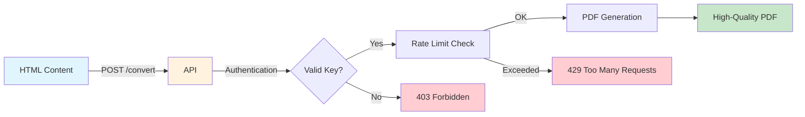

# 📄 HTML-to-PDF Converter API

<div align="center">


**Transform HTML to Professional PDFs in Seconds** 🚀

*A lightning-fast, production-ready REST API for converting HTML content to high-quality PDF documents. Perfect for invoices, reports, certificates, and any document automation needs.*

[Features](#-features) • [Quick Start](#-quick-start) • [API Docs](#-api-documentation) • [Examples](#-usage-examples) • [Deployment](#-deployment)

</div>

---

## 🎯 Why Choose HTML-to-PDF API?

<table>
<tr>
<td width="33%" align="center">

<h3>🚀 REST API</h3>
Simple HTTP endpoints that work with any programming language
</td>
<td width="33%" align="center">

<h3>🔒 Secure</h3>
Multi-key authentication, rate limiting, and super-user admin access
</td>
<td width="33%" align="center">

<h3>⚡ Fast</h3>
High-quality PDF rendering in milliseconds with concurrent processing
</td>
</tr>
<tr>
<td width="33%" align="center">

<h3>📦 Easy Deploy</h3>
One-command deployment with systemd or Docker support
</td>
<td width="33%" align="center">

<h3>🎨 Custom Styling</h3>
Full CSS support for pixel-perfect document design
</td>
<td width="33%" align="center">

<h3>📊 Scalable</h3>
Handle thousands of PDFs with Gunicorn workers and rate limiting
</td>
</tr>
</table>

---

## ✨ Key Features



### 🎯 Core Features

- ✅ **REST API** - Simple JSON endpoints for PDF generation
- ✅ **High-Quality Output** - Professional PDF rendering using WeasyPrint
- ✅ **Custom CSS Styling** - Full control over document appearance
- ✅ **Multi-Key Authentication** - Secure API key management system
- ✅ **Rate Limiting** - Protect your API with configurable limits (60/min, 1000/hr)
- ✅ **Admin API** - Manage API keys via HTTP endpoints
- ✅ **Production Ready** - Includes error handling, logging, and monitoring
- ✅ **Lightweight & Fast** - Minimal dependencies, maximum performance

---

## 📊 Use Cases

<div align="center">

| Use Case | Description | Example |
|----------|-------------|---------|
| 📝 **Invoices** | Generate professional invoices with custom branding | E-commerce, SaaS billing |
| 📄 **Reports** | Create data-driven reports with charts and tables | Analytics, Business Intelligence |
| 🎓 **Certificates** | Issue certificates, diplomas, and credentials | Online courses, Training platforms |
| 📋 **Contracts** | Generate legal documents and agreements | HR systems, Legal tech |
| 📧 **Email Attachments** | Create PDF attachments for automated emails | CRM, Marketing automation |
| 📦 **Labels & Tickets** | Generate shipping labels, tickets, and passes | Logistics, Event management |

</div>

---

## 🚀 Performance Metrics

<div align="center">

```
┌─────────────────────────────────────────────────────────────┐
│  Average Response Times (Simple HTML)                       │
├─────────────────────────────────────────────────────────────┤
│  Simple Document (1 page):    ~200ms  ████░░░░░░░░░░░░░░░  │
│  Complex Document (5 pages):  ~800ms  ████████████░░░░░░░░  │
│  With Images (10 pages):      ~1.5s   ████████████████████  │
└─────────────────────────────────────────────────────────────┘

┌─────────────────────────────────────────────────────────────┐
│  Concurrent Requests (4 workers)                            │
├─────────────────────────────────────────────────────────────┤
│  Throughput: ~240 PDFs/minute                               │
│  Max File Size: 16MB                                        │
│  Rate Limit: 60 req/min per key                            │
└─────────────────────────────────────────────────────────────┘
```

</div>

---

## 🔧 Prerequisites

<table>
<tr>
<td width="50%">

### System Requirements
- **Python 3.8+** 
- **2GB RAM minimum**
- **Linux/macOS/Windows**
- **500MB disk space**

</td>
<td width="50%">

### Dependencies
```bash
# Ubuntu/Debian
sudo apt-get install python3-dev \
  libcairo2 libpango-1.0-0 \
  libgdk-pixbuf2.0-0 libffi-dev
```

</td>
</tr>
</table>
## 💿 Installation

### Quick Install (3 Steps)

```bash
# 1️⃣ Clone the repository
git clone https://github.com/systemifyautomation/HTML-to-PDF.git
cd HTML-to-PDF

# 2️⃣ Create virtual environment
python3 -m venv venv
source venv/bin/activate  # Linux/macOS
# venv\Scripts\activate    # Windows

# 3️⃣ Install dependencies
pip install -r requirements.txt
```

<div align="center">

**🎉 That's it! You're ready to go!**

</div>

---

## 🚀 Quick Start

### 1. Start the Server

```bash
python app.py
```

<div align="center">

```
INFO:__main__:Starting HTML to PDF Converter API on port 5000
 * Running on http://0.0.0.0:5000
```

✅ **Server is running!**

</div>

### 2. Test with cURL

```bash
# Health check
curl http://localhost:5000/health

# Create your first PDF
curl -X POST http://localhost:5000/convert \
  -H "Content-Type: application/json" \
  -H "X-API-Key: your-api-key" \
  -d '{"html": "<h1>Hello PDF!</h1><p>My first document</p>"}' \
  --output my-first.pdf
```

### 3. View Result

```bash
# Open the PDF
open my-first.pdf  # macOS
xdg-open my-first.pdf  # Linux
start my-first.pdf  # Windows
```

You should see output similar to:
```
INFO:__main__:Starting HTML to PDF Converter API on port 5000
 * Running on http://0.0.0.0:5000
```

### Test the API

Open a new terminal and run:

```bash
curl http://localhost:5000/health
```

You should receive a response indicating the service is healthy.

## 📚 API Documentation

### Base URL

---

## 📚 API Documentation

### Base URL

```
http://your-domain.com:9001
```

### 🔐 Authentication

All endpoints (except `/` and `/health`) require an API key in the header:

```http
X-API-Key: your-api-key-here
```

### 📍 Endpoints

<table>
<tr>
<th>Endpoint</th>
<th>Method</th>
<th>Auth</th>
<th>Description</th>
</tr>
<tr>
<td><code>/</code></td>
<td>GET</td>
<td>❌</td>
<td>API documentation</td>
</tr>
<tr>
<td><code>/health</code></td>
<td>GET</td>
<td>❌</td>
<td>Health check</td>
</tr>
<tr>
<td><code>/convert</code></td>
<td>POST</td>
<td>✅</td>
<td>Convert HTML to PDF</td>
</tr>
<tr>
<td><code>/admin/keys</code></td>
<td>GET</td>
<td>🔑 Super User</td>
<td>List all API keys</td>
</tr>
<tr>
<td><code>/admin/keys</code></td>
<td>POST</td>
<td>🔑 Super User</td>
<td>Create new API key</td>
</tr>
<tr>
<td><code>/admin/keys/&lt;prefix&gt;</code></td>
<td>PATCH</td>
<td>🔑 Super User</td>
<td>Update API key</td>
</tr>
<tr>
<td><code>/admin/keys/&lt;prefix&gt;</code></td>
<td>DELETE</td>
<td>🔑 Super User</td>
<td>Delete API key</td>
</tr>
</table>

---

### 🎯 Main Endpoint: `/convert`

#### Request

```http
POST /convert
Content-Type: application/json
```

#### Request Body

```json
{
  "html": "<html><body><h1>Invoice</h1><p>Total: $500</p></body></html>",
  "css": "body { font-family: Arial; margin: 40px; }",
  "filename": "invoice.pdf"
}
```

| Parameter | Type   | Required | Description                                    |
|-----------|--------|----------|------------------------------------------------|
| `html`      | string | ✅ Yes      | HTML content to convert                        |
| `css`       | string | ❌ No       | Additional CSS styles to apply                 |
| `filename`  | string | ❌ No       | Output filename (default: document.pdf)        |

#### Response

**Success (200 OK)**
```http
Content-Type: application/pdf
Content-Disposition: attachment; filename="invoice.pdf"

[PDF Binary Data]
```

**Error Responses**

| Code | Error | Description |
|------|-------|-------------|
| 401 | Unauthorized | Missing or invalid API key |
| 429 | Too Many Requests | Rate limit exceeded (60/min) |
| 400 | Bad Request | Invalid HTML or missing required fields |
| 413 | Payload Too Large | Request exceeds 16MB limit |
| 500 | Internal Server Error | PDF generation failed |

---

## 💡 Usage Examples

### 📝 Example 1: Simple Invoice

```bash
curl -X POST http://htmltopdf.systemifyautomation.com:9001/convert \
  -H "Content-Type: application/json" \
  -H "X-API-Key: your-api-key-here" \
  -d '{
    "html": "<!DOCTYPE html><html><body><h1>Hello PDF!</h1><p>This is a test document.</p></body></html>",
    "filename": "test.pdf"
  }' \
  --output test.pdf
```

### Example 2: Using Python

```python
import requests

# Prepare the HTML content
html_content = """
<!DOCTYPE html>
<html>
<head>
    <title>My Document</title>
</head>
<body>
    <h1>Invoice</h1>
    <p>Total Amount: $100.00</p>
</body>
</html>
"""

# Send request to API
response = requests.post(
    'http://localhost:5000/convert',
    headers={
        'X-API-Key': 'your-api-key-here'
    },
    json={
        'html': html_content,
        'filename': 'invoice.pdf'
    }
)

# Save the PDF
if response.status_code == 200:
    with open('invoice.pdf', 'wb') as f:
        f.write(response.content)
    print("PDF generated successfully!")
else:
    print(f"Error: {response.text}")
```

### Example 3: Using JavaScript (Node.js)

```javascript
const fetch = require('node-fetch');
const fs = require('fs');

const html = `
<!DOCTYPE html>
<html>
<body>
    <h1>Hello from Node.js!</h1>
</body>
</html>
`;

fetch('http://localhost:5000/convert', {
    method: 'POST',
    headers: {
        'Content-Type': 'application/json',
        'X-API-Key': 'your-api-key-here'
    },
    body: JSON.stringify({
        html: html,
        filename: 'nodejs-example.pdf'
    })
})
.then(res => res.buffer())
.then(buffer => {
    fs.writeFileSync('nodejs-example.pdf', buffer);
    console.log('PDF saved!');
})
.catch(err => console.error('Error:', err));
```

### Example 4: With Custom CSS

```python
import requests

html = """
<!DOCTYPE html>
<html>
<body>
    <div class="header">
        <h1>Styled Document</h1>
    </div>
    <div class="content">
        <p>This document has custom styling.</p>
    </div>
</body>
</html>
"""

css = """
.header {
    background-color: #007bff;
    color: white;
    padding: 20px;
    text-align: center;
}
.content {
    margin: 20px;
    font-size: 16px;
}
"""

response = requests.post(
    'http://localhost:5000/convert',
    json={
        'html': html,
        'css': css,
        'filename': 'styled-document.pdf'
    }
)

with open('styled-document.pdf', 'wb') as f:
    f.write(response.content)
```

### Example 5: Run Provided Examples

We've included ready-to-use examples in the `examples` directory:

```bash
# Make sure the API is running first
python app.py

# In another terminal, run the examples
python examples/usage_example.py
```

This will generate several PDF files demonstrating different use cases:
- Simple HTML conversion
- HTML with custom CSS
- Invoice template
- Report template

## ⚙️ Configuration

### Environment Variables

You can configure the application using environment variables:

| Variable | Default | Description                           |
|----------|---------|---------------------------------------|
| PORT     | 5000    | Port number for the API server        |
| DEBUG    | False   | Enable debug mode (True/False)        |
| API_KEY  | None    | API key for authentication (required for production) |

### Setting Up API Authentication

**1. Generate a secure API key:**

```bash
# Using Python
python -c "import secrets; print(secrets.token_urlsafe(32))"

# Or use any secure random string generator
```

**2. Create a `.env` file:**

Copy `.env.example` to `.env` and set your API key:

```bash
cp .env.example .env
```

Edit `.env`:
```env
PORT=9001
DEBUG=False
API_KEY=your-generated-secure-api-key-here
```

**3. The `.env` file is in `.gitignore`** - it will NOT be committed to GitHub, keeping your API key secure.

### Setting Environment Variables

**Linux/macOS:**
```bash
export PORT=8080
export DEBUG=True
export API_KEY=your-api-key-here
python app.py
```

**Windows (Command Prompt):**
```cmd
set PORT=8080
set DEBUG=True
set API_KEY=your-api-key-here
python app.py
```

**Using .env file (Recommended):**

Create a `.env` file in the project root:
```env
PORT=9001
DEBUG=False
API_KEY=your-secure-api-key-here
```

The application will automatically load these variables.

### Application Settings

You can modify the following settings in `app.py`:

- **MAX_CONTENT_LENGTH**: Maximum request size (default: 16MB)
  ```python
  app.config['MAX_CONTENT_LENGTH'] = 16 * 1024 * 1024
  ```

- **Logging Level**: Adjust logging verbosity
  ```python
  logging.basicConfig(level=logging.INFO)  # or DEBUG, WARNING, ERROR
  ```

## 🚢 Deployment

### Production VPS Deployment (Recommended)

For detailed instructions on deploying to a VPS (like Hostinger), see **[DEPLOYMENT.md](DEPLOYMENT.md)**. This includes:
- Complete step-by-step VPS setup
- Systemd service configuration
- Nginx reverse proxy with SSL
- Monitoring and maintenance

**Quick VPS Deployment:**
```bash
# On your VPS
cd /path/to/HTML-to-PDF
./deployment/deploy.sh
```

### Using Gunicorn (Production)

For production deployments, use Gunicorn instead of the Flask development server:

```bash
gunicorn -w 4 -b 0.0.0.0:9000 app:app
```

Options:
- `-w 4`: Number of worker processes (adjust based on your CPU cores)
- `-b 0.0.0.0:9000`: Bind to all interfaces on port 9000
- `--timeout 120`: Request timeout in seconds (useful for large PDFs)

### Docker Deployment

Create a `Dockerfile`:

```dockerfile
FROM python:3.10-slim

# Install system dependencies
RUN apt-get update && apt-get install -y \
    python3-dev \
    python3-pip \
    libcairo2 \
    libpango-1.0-0 \
    libpangocairo-1.0-0 \
    libgdk-pixbuf2.0-0 \
    libffi-dev \
    shared-mime-info \
    && rm -rf /var/lib/apt/lists/*

WORKDIR /app

COPY requirements.txt .
RUN pip install --no-cache-dir -r requirements.txt

COPY . .

EXPOSE 5000

CMD ["gunicorn", "-w", "4", "-b", "0.0.0.0:5000", "--timeout", "120", "app:app"]
```

Build and run:
```bash
docker build -t html-to-pdf .
docker run -p 5000:5000 html-to-pdf
```

### Cloud Deployment

The application can be deployed to various cloud platforms:

- **VPS (Hostinger, DigitalOcean, Linode)**: See [DEPLOYMENT.md](DEPLOYMENT.md)
- **Heroku**: Use the provided `Procfile`
- **AWS Elastic Beanstalk**: Use the provided `requirements.txt`
- **Google Cloud Run**: Use the Docker deployment method
- **Azure App Service**: Deploy directly from GitHub

## 🔍 Troubleshooting

### Common Issues

#### 1. WeasyPrint Installation Fails

**Problem**: Error installing WeasyPrint or its dependencies.

**Solution**: 
- Ensure system dependencies are installed (see Prerequisites)
- On Windows, follow the [official WeasyPrint Windows guide](https://doc.courtbouillon.org/weasyprint/stable/first_steps.html#windows)
- Try upgrading pip: `pip install --upgrade pip`

#### 2. PDF Generation Fails

**Problem**: API returns 500 error when converting HTML.

**Solution**:
- Check the server logs for detailed error messages
- Ensure your HTML is valid (use an HTML validator)
- Verify CSS syntax if providing custom styles
- Check if images in HTML are accessible (use absolute URLs)

#### 3. Port Already in Use

**Problem**: Error "Address already in use" when starting the server.

**Solution**:
- Change the port: `PORT=8080 python app.py`
- Or stop the process using port 5000:
  ```bash
  # Linux/macOS
  lsof -ti:5000 | xargs kill -9
  
  # Windows
  netstat -ano | findstr :5000
  taskkill /PID <PID> /F
  ```

#### 4. Request Too Large Error

**Problem**: Getting 413 error for large HTML content.

**Solution**:
- Increase the maximum content length in `app.py`:
  ```python
  app.config['MAX_CONTENT_LENGTH'] = 32 * 1024 * 1024  # 32MB
  ```
- Consider splitting large documents into multiple smaller PDFs

#### 5. Fonts Not Rendering Correctly

**Problem**: Special fonts or characters don't appear in PDF.

**Solution**:
- Include web fonts using `@font-face` in your CSS
- Use Google Fonts: `<link href="https://fonts.googleapis.com/css2?family=Roboto" rel="stylesheet">`
- Ensure the font files are accessible to the server

### Debug Mode

Enable debug mode for detailed error messages:

```bash
DEBUG=True python app.py
```

**Note**: Never use debug mode in production!

### Getting Help

If you encounter issues:

1. Check the [Issues](https://github.com/systemifyautomation/HTML-to-PDF/issues) page
2. Review the logs for error messages
3. Ensure all prerequisites are installed correctly
4. Try the provided examples to verify basic functionality

## 📁 Project Structure

```
HTML-to-PDF/
├── app.py                      # Main Flask application
├── requirements.txt            # Python dependencies
├── .gitignore                 # Git ignore rules
├── README.md                  # This file
└── examples/                  # Example templates and scripts
    ├── invoice_template.html  # Invoice example
    ├── report_template.html   # Report example
    ├── simple_template.html   # Simple example
    └── usage_example.py       # Python usage examples
```

## 🛠️ Technology Stack

- **Flask**: Web framework for the REST API
- **WeasyPrint**: HTML to PDF rendering engine
- **Jinja2**: Template engine (included with Flask)
- **Gunicorn**: Production WSGI server
- **Python 3.8+**: Programming language

## 📈 Performance Tips

1. **Use Caching**: Cache frequently used templates to reduce processing time
2. **Optimize Images**: Compress images before including them in HTML
3. **Minimize CSS**: Remove unused CSS rules to reduce file size
4. **Increase Workers**: Scale Gunicorn workers based on traffic
5. **Load Balancing**: Use a reverse proxy (Nginx) for high traffic

## 🔒 Security Considerations

1. **Input Validation**: The API validates all inputs to prevent injection attacks
2. **Request Size Limits**: Maximum request size is enforced (16MB default)
3. **HTTPS**: Always use HTTPS in production
4. **Rate Limiting**: Consider adding rate limiting for public APIs
5. **Authentication**: Add API authentication for production use

## 📝 Use Cases

This HTML-to-PDF converter is perfect for:

- **Invoices & Receipts**: Generate professional invoices from order data
- **Reports**: Create business reports with charts and tables
- **Certificates**: Generate certificates of completion or achievement
- **Contracts**: Create PDF contracts from templates
- **Newsletters**: Convert HTML emails to PDF archives
- **Tickets**: Generate event tickets or boarding passes
- **Labels**: Create shipping labels or product tags
- **Documentation**: Convert HTML documentation to PDF

## 🤝 Contributing

Contributions are welcome! Here's how you can help:

1. Fork the repository
2. Create a feature branch: `git checkout -b feature-name`
3. Make your changes
4. Test thoroughly
5. Commit your changes: `git commit -am 'Add new feature'`
6. Push to the branch: `git push origin feature-name`
7. Submit a pull request

Please ensure your code follows the existing style and includes appropriate tests.

## 📄 License

This project is open source and available under the [MIT License](LICENSE).

## 🙏 Acknowledgments

- [WeasyPrint](https://weasyprint.org/) for the excellent HTML to PDF rendering
- [Flask](https://flask.palletsprojects.com/) for the web framework
- All contributors who help improve this project

## 📞 Support

For questions or support:
- Open an [issue](https://github.com/systemifyautomation/HTML-to-PDF/issues)
- Check existing issues for solutions
- Review the troubleshooting section

---

**Made with ❤️ for developers who need to generate PDFs**

Happy PDF generating! 🎉
